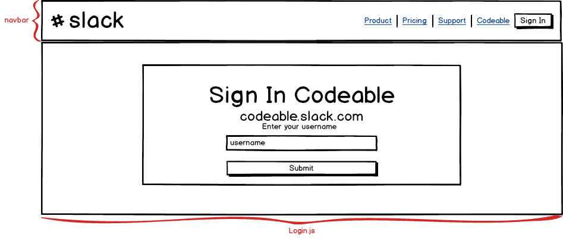
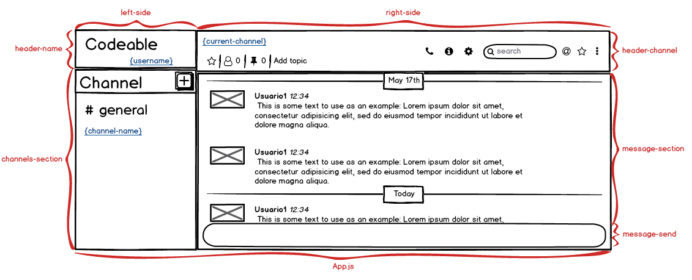
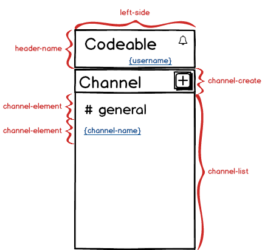
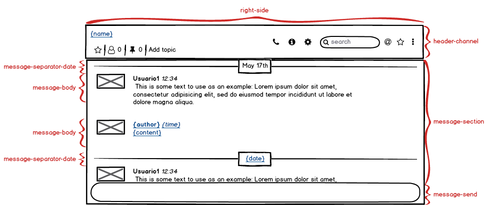
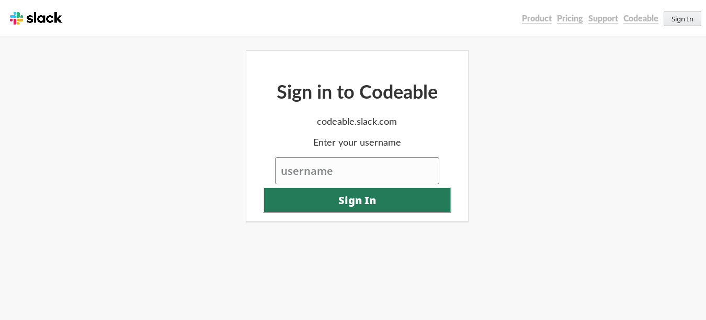
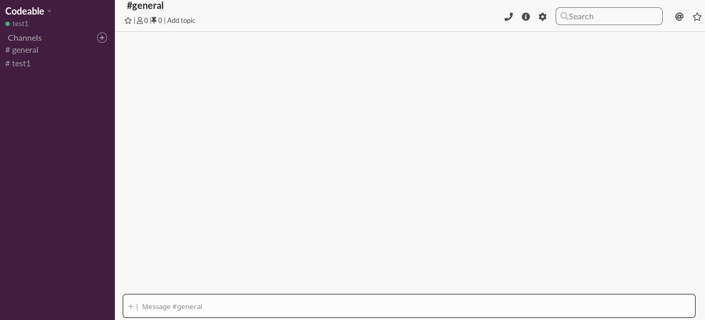
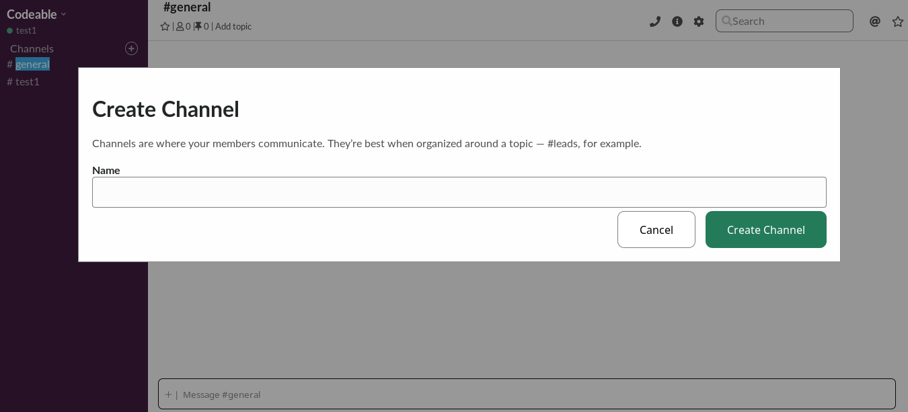

# React Slack Clone

Create a multi channel chat application using the WebSocket server in [codeableorg/websocket-server](https://github.com/codeableorg/websocket-server) as your WebSocket server and React for your Frontend.

## Team Members

- Carlos Ayala: Project Lead
- Brayan Ciudad: Tech lead
- Diego Cuevas: Developer
- Cristian Granda: Developer
- Jonathan Mendoza: Developer


## Requirements

- [ ] The user should be asked for a username when trying to access.
  - [ ] The username should be stored for future usage if the user reload the page. (_optional_)
- [ ] After accessing the chat the user should be automatically joined to the `#general` channel.
- [ ] A user should have an option to change, and join, to another channel.
  - [ ] If the channel doesn't exists create one.
  - [ ] After the channel is created a message should be sent to the WebSocket server to notify other users. (_optional_)
- [ ] Previously accessed channels should be remembered after a page reload. (_optional_)
- [ ] Previously received messages should be remembered after a page reload. (_optional_)
  - [ ] Stored messages should be displayed with a disabled state after the user access the chat again. (_optional_)
- [ ] The user should receive notifications of new messages in the following conditions: (_optional_)
  - [ ] When a message is received on the non active channel and the page is visible. (_optional_)
  - [ ] When a message is received on the active channel and the page is not visible. (_optional_)
- [ ] A message must have a content, an author and the date.
- [ ] The date of a message should be displayed as only the hour with minutes.
- [ ] The messages should be grouped by date, without caring about the hour and minutes. (_optional_)
  - [ ] The grouped messages should have a visual separator with other groups. (_optional_)
  - [ ] The current day should be displayed as `Today`. (_optional_)
  - [ ] The previous day should be displayed as `Yesterday`. (_optional_)

## Acceptance Criteria

- [ ] It must use semantic HTML
- [ ] It must use React
- [ ] It must be responsive
- [ ] It must use CSS in JS
- [ ] It must pass with green the Accessibility tests of the Chrome Audits
- [ ] It must pass with green the Best Practices tests of the Chrome Audits
- [ ] It must pass with green the SEO tests of the Chrome Audits
- [ ] The server code should not be modified in any way


## Project Execution

To execute the project, do the following:
```
npm install
npm start
```
the script is adapted to launch the service through `PORT=4000`.

In another terminal window do:
```
cd client/
npm install
npm start
```

## Project components

Components in `Login`



Components in `App`



Components in `left-side`



Components in `right-side`



Source file is a [Balsamiq](https://balsamiq.com/) file: [slack_project.bmpr](./client/documentation/slack_project.bmpr)

## User Interface

Login screen



Chat Window



Chat Window, create channel

